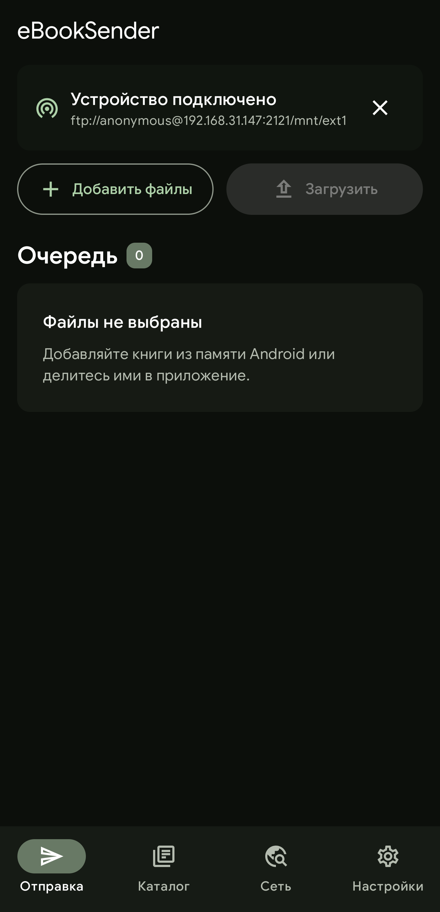
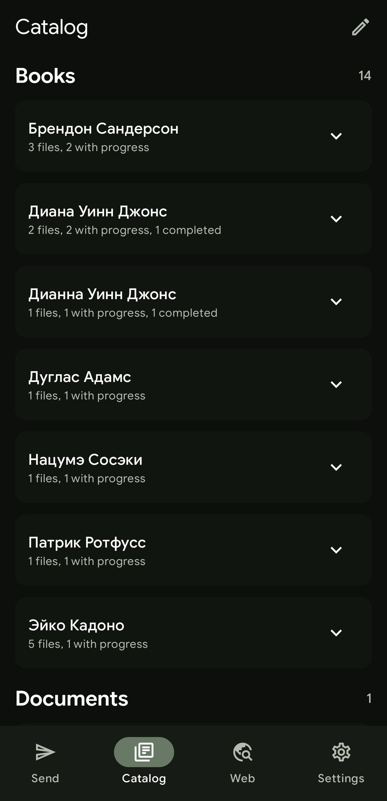
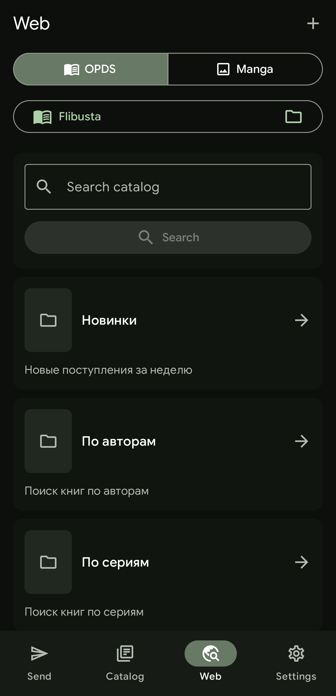
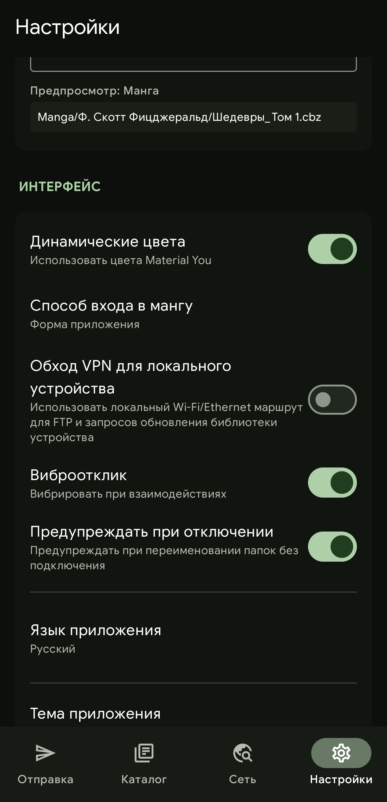

<div align="center">

# eBookSender

### Android-приложение для отправки книг, документов и манги на электронную книгу по FTP

[](../../releases/latest)
[](https://developer.android.com/)
[](https://developer.android.com/about/versions/oreo)
[](LICENSE)

</div>

---

**eBookSender** — Android-приложение для передачи книг, документов и манги на электронные книги по FTP. Оно работает в локальной сети, не требует облачных сервисов или промежуточного компьютера, умеет планировать структуру каталогов на устройстве и объединяет локальные файлы, OPDS-каталоги и загрузку манги в одну очередь отправки.

Если на электронной книге есть FTP-сервер, достаточно установить APK, подключить телефон и устройство к одной Wi-Fi сети либо включить точку доступа на телефоне и подключить к ней электронную книгу, а затем указать FTP-адрес в приложении.

---

## Ключевые возможности

### Передача и каталогизация

- Поддерживаемые форматы: `epub`, `fb2`, `mobi`, `azw3`, `txt`, `rtf`, `pdf`, `djvu`, `doc`, `docx`, `cbz`, `cbr`.
- Добавление файлов из приложения и через системное меню Android **«Поделиться»**.
- Одиночная и массовая отправка с очередью, прогрессом и фоновой передачей через foreground service.
- Настраиваемая раскладка по каталогам для книг, документов и манги.
- Шаблоны имён с токенами `{title}`, `{author}`, `{tag}`, `{series}`, `{volume}`, `{year}`, `{language}`, `{index}`, `{publisher}`, `{ext}`, `{original}`.
- Передача выполняется атомарно: файл сначала загружается как временный `.uploading`, а затем переименовывается после успешной отправки.

### Метаданные и подготовка файлов

- Извлечение названия, автора, серии, года, языка, издателя и других доступных метаданных из поддерживаемых форматов.
- Превью обложек в очереди отправки для EPUB, FB2, MOBI/AZW3, PDF и архивов манги.
- Ручная корректировка категории, серии и других данных перед отправкой.
- Массовое изменение серии для нескольких глав манги в очереди.
- Для CBZ приложение обновляет `ComicInfo.xml` и приводит структуру архива к единому виду перед отправкой.

### Работа с устройством

- Подключение по QR-коду или ручной ввод FTP-адреса.
- Автоматическое определение PocketBook по служебной базе `explorer-3.db`; остальные FTP-серверы используются как универсальные устройства.
- Просмотр каталога подключенного устройства, удаление файлов и папок с подтверждением.
- Мультивыделение, drag-выделение и автоскролл в режиме редактирования.
- Опциональный обход VPN для локальных FTP-подключений.

### Встроенные источники

- Подключение к онлайн-библиотекам по протоколу OPDS.
- Поиск, навигация по каталогам, обложки и скачивание книг в очередь.
- Поддержка нескольких OPDS-источников и HTTP Basic Auth.
- Защищенное хранение OPDS-учетных данных через Android Keystore с AES/GCM.
- Поиск серий и глав в Com-X, загрузка глав в CBZ, избранное, подписки и история загрузок.

### Интерфейс

- Jetpack Compose и Material 3.
- Светлая, темная и системная темы, Dynamic Color на Android 12+.
- Адаптивная навигация для телефонов и планшетов.
- Русский и английский языки из коробки.
- Пользовательские переводы через JSON: можно взять [шаблон](docs/locales/translation-template.json) или [английский пример](app/src/main/assets/locales/en.json), затем положить готовый `.json` в `eBookSender/locales/` на устройстве.
- Тактильная обратная связь с возможностью отключения.

---

## Скриншоты

<div align="center">

<table>
  <tr>
    <td width="50%" align="center" valign="top">
      <br>
      <sub>Отправка</sub>
    </td>
    <td width="50%" align="center" valign="top">
      <br>
      <sub>Каталог устройства</sub>
    </td>
  </tr>
  <tr>
    <td width="50%" align="center" valign="top">
      <br>
      <sub>Web / OPDS</sub>
    </td>
    <td width="50%" align="center" valign="top">
      <br>
      <sub>Настройки</sub>
    </td>
  </tr>
</table>

</div>

## Установка

Требования: Android 8.0+ и электронная книга с FTP-сервером в той же локальной сети.

Для устройств PocketBook FTP-сервер можно взять из проекта [pb-ftp](https://github.com/CyberCat2033/pb-ftp).

Готовые APK публикуются на странице [Releases](../../releases/latest):

| Файл | Когда выбирать |
| --- | --- |
| `eBookSender-vX.Y.Z-universal.apk` | универсальный вариант, если архитектура устройства неизвестна |
| `eBookSender-vX.Y.Z-arm64-v8a.apk` | большинство современных Android-устройств |
| `eBookSender-vX.Y.Z-armeabi-v7a.apk` | старые 32-битные ARM-устройства |

После установки подключение выполняется из приложения: QR-код с FTP-адресом или ручной ввод адреса сервера.

---

## Сборка для разработчиков

### Требования

| Компонент | Версия |
| --- | --- |
| Android Studio | актуальная версия с поддержкой AGP 8.13 |
| Android SDK Platform | 36 |
| Android SDK Build Tools | 34+ |
| JDK | 17+ |
| Gradle | 8.13 через wrapper |

### Клонирование

```sh
git clone https://github.com/CyberCat2033/eBookSender.git
cd eBookSender
```

### Debug-сборка

```sh
./gradlew :app:assembleDebug
```

APK появится здесь:

```text
app/build/outputs/apk/debug/app-debug.apk
```

### Тесты

```sh
./gradlew test
```

Запускает unit-тесты всех модулей.

---

## Архитектура проекта

Проект собран как модульное Android-приложение. В `settings.gradle.kts` подключены 14 модулей:

```text
app
core:model
core:common
core:domain
core:database
core:datastore
core:network
core:data
core:ui
feature:catalog
feature:manga
feature:opds
feature:settings
feature:transfer
```

Основные зоны ответственности:

| Модуль | Назначение |
| --- | --- |
| `app` | точка входа, Android manifest, DI, foreground services, обработка share-интентов |
| `core:model` | общие модели приложения |
| `core:common` | общие утилиты, кэш, форматирование, сетевые исключения |
| `core:domain` | классификация файлов, планирование путей, парсинг FTP URL и санитизация имен |
| `core:database` | Room-база, DAO и сущности |
| `core:datastore` | хранение настроек приложения |
| `core:network` | OPDS, Com-X, HTTP-клиенты и парсеры |
| `core:data` | репозитории, FTP-шлюз, каталог устройства, загрузка OPDS и манги |
| `core:ui` | тема, общие UI-компоненты, локализация, жесты, haptics |
| `feature:transfer` | экран отправки и управление очередью |
| `feature:catalog` | каталог подключенного устройства |
| `feature:opds` | OPDS-браузер |
| `feature:manga` | поиск, загрузка, избранное и подписки манги |
| `feature:settings` | настройки хранения, интерфейса, именования и обслуживания |

Дополнительная техническая карта проекта находится в [CODEX_PROJECT_MAP.md](CODEX_PROJECT_MAP.md).

---

## Технологии

| Технология | Для чего используется |
| --- | --- |
| Kotlin 2.0.21 | основной язык разработки |
| Jetpack Compose | декларативный UI |
| Material 3 | дизайн-система приложения |
| Hilt | внедрение зависимостей |
| Room 2.6.1 | локальная база данных |
| DataStore | настройки приложения |
| Apache Commons Net 3.13.0 | FTP-клиент |
| Android Keystore | защищенное хранение OPDS-учетных данных |
| kotlinx.serialization | JSON-сериализация |
| JSoup 1.18.3 | HTML/XML-парсинг для сетевых источников |
| Play Services Code Scanner | сканирование QR-кодов |
| Junrar 7.6.0 | чтение CBR/RAR-архивов |

---

## Участие в проекте

Сообщения о багах, идеи и pull request'ы приветствуются.

- Если нашли ошибку, создайте [Issue](../../issues) и опишите шаги воспроизведения.
- Если предлагаете изменение поведения, опишите сценарий пользователя и ожидаемый результат.
- Для изменений в коде создайте fork, отдельную ветку и pull request.
- Для переводов можно обновить JSON-файлы локализации или приложить новый перевод.

---

## Лицензия

Проект распространяется под лицензией **GNU General Public License v2.0**.

```text
eBookSender — FTP-клиент для отправки книг и манги на электронные книги.
Copyright (C) 2026 CyberCat

This program is free software; you can redistribute it and/or modify
it under the terms of the GNU General Public License as published by
the Free Software Foundation; either version 2 of the License, or
(at your option) any later version.

This program is distributed in the hope that it will be useful,
but WITHOUT ANY WARRANTY; without even the implied warranty of
MERCHANTABILITY or FITNESS FOR A PARTICULAR PURPOSE. See the
GNU General Public License for more details.
```

Полный текст лицензии находится в [LICENSE](LICENSE).
